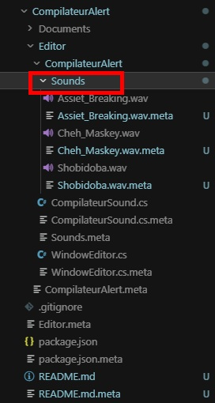
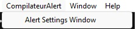
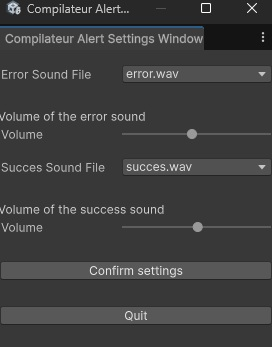

# Compilateur Alert

Ce plugin joue un son dans l’éditeur Unity à la fin d’une compilation, selon le résultat :

- **Succès** (aucune erreur C# détectée)
- **Erreur** (au moins une erreur C# détectée)

Les sons et leurs **volumes** sont réglables indépendamment via une fenêtre `EditorWindow`.

## Fonctionnement

Le script `CompilateurSound` s’exécute uniquement dans l’éditeur (`#if UNITY_EDITOR`) et :

1. s’abonne à `CompilationPipeline.compilationStarted` et `CompilationPipeline.compilationFinished`
2. pendant la compilation, analyse les logs pour détecter des lignes contenant `error CS`
3. quand la compilation se termine, il joue le son **Succès** ou **Erreur**
4. la lecture se fait via un `AudioSource` temporaire (donc **pas besoin** d’un AudioSource placé dans une scène)

## Installation

### Installation via lien git

Dans le Package manager, ajouter un package depuis git en utilisant le lien du repo

## Où placer tes sons

Les fichiers doivent être des `.wav` placés dans le dossier `Sounds` situé **à côté de** `CompilateurSound.cs` dans le package.

  

Le plugin liste automatiquement les fichiers `.wav` présents dans ce dossier dans la fenêtre de configuration.

## Ajouter / remplacer des sons

1. Ajoute ton fichier `*.wav` dans le dossier `Sounds`
2. Ouvre la fenêtre de configuration : `CompilateurAlert/Alert Settings Window`

3. Choisis indépendamment :
  - **Error Sound File**
  - **Succes Sound File**
4. Régle le **volume** de chaque évènement
5. Clique sur **Confirm settings** pour sauvegarder les paramètres

## Fenêtre de configuration (WindowEditor)

Pour ouvrir la fenêtre :

- menu Unity : `CompilateurAlert/Settings Window`

Dans la fenêtre :

- `Dropdown` **Error Sound File** : choisir le son d’erreur
- `Slider` **Volume (error)** : régler le volume de l’erreur
- `Dropdown` **Succes Sound File** : choisir le son de succès
- `Slider` **Volume (success)** : régler le volume du succès
- bouton **Confirm settings** : sauvegarde les réglages (persistant via `EditorPrefs`)

Ensuite, à la prochaine compilation, le plugin joue le bon son avec le bon volume.

## Noms par défaut

Par défaut, le plugin attend :

- `error.wav` pour les erreurs
- `succes.wav` pour le succès

Les noms sélectionnés dans la fenêtre doivent correspondre **exactement** aux fichiers présents dans `Sounds`.

## Débogage rapide

Si aucun son ne sort :

- vérifie que les fichiers `*.wav` existent bien dans le dossier `Sounds`
- vérifie la Console (messages du style “fichier audio introuvable”)
- vérifie que tu as cliqué sur **Confirm settings** après modification des choix/volumes

